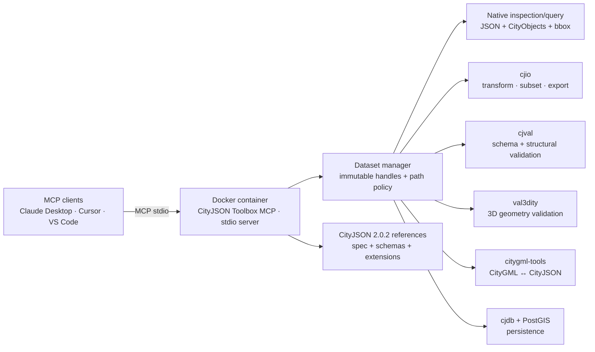
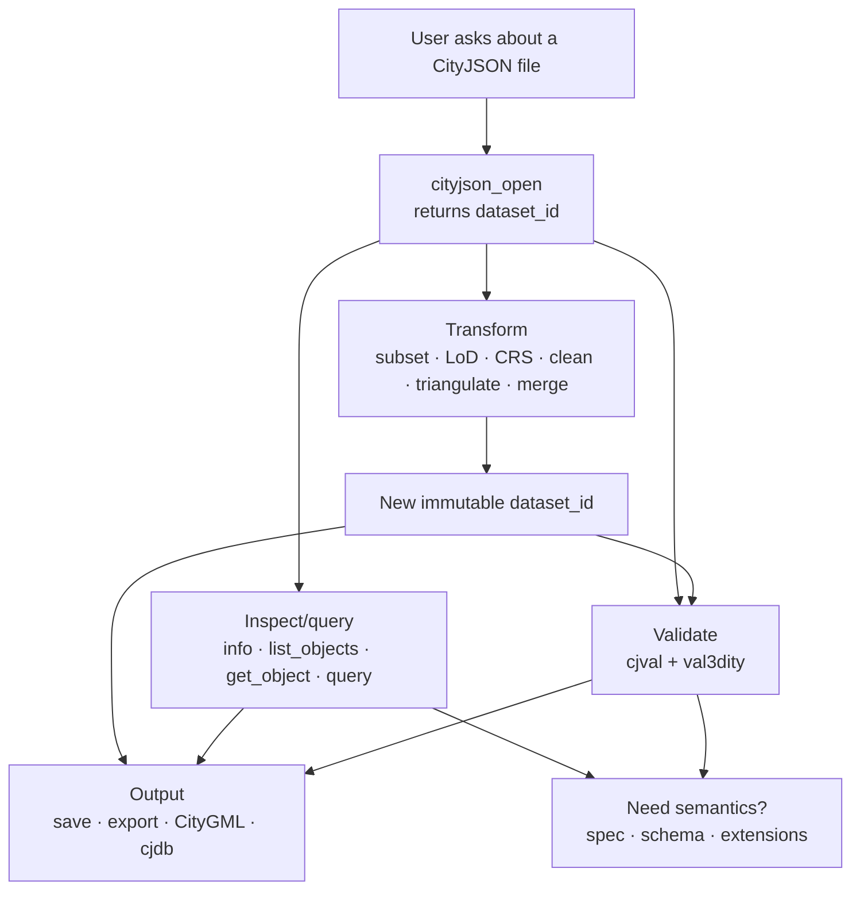
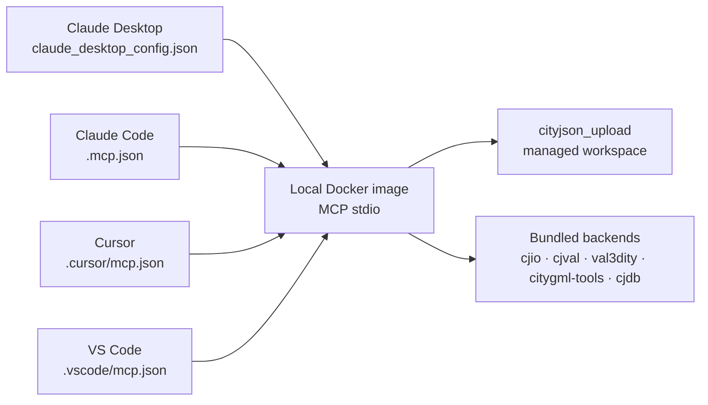
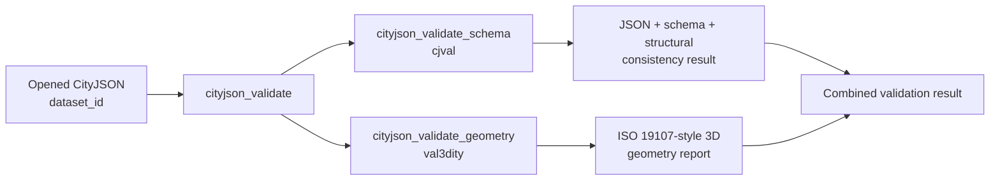

# CityJSON Toolbox MCP

A local **Model Context Protocol (MCP) server for actually working with CityJSON**, rather than only reading the specification.

It gives MCP clients such as Claude Desktop, Cursor and VS Code a stable CityJSON-oriented tool API backed by:

- **cjio** — CityJSON manipulation, filtering, CRS operations, cleanup, merging and export.
- **cjval** — official CityJSON/CityJSONSeq syntax, schema and structural validation.
- **val3dity** — 3D geometric validity checking for CityJSON primitives.
- **citygml-tools** — CityGML ↔ CityJSON conversion.
- **cjdb + PostgreSQL/PostGIS** — persistent CityJSON storage/import/export.
- **CityJSON 2.0.2 specification, JSON Schemas and Extensions registry** — live canonical reference access for the agent.

The server exposes **35 MCP tools**. Transformations use **immutable dataset handles**: an operation such as `cityjson_subset` returns a new `dataset_id` and does not overwrite the source dataset.

> Status: this is a practical v0.1 implementation. The recommended Docker image bundles every external backend; host-native development still requires installing the individual commands.

## Architecture



[Download PNG — high resolution](diagrams/architecture.png)

The MCP-facing API deliberately does **not** expose arbitrary shell commands such as `run_cjio("...")`. Each MCP tool has a typed input schema. Commands are invoked with `spawn(..., { shell: false })`, which keeps the agent-facing contract stable and avoids shell-string interpolation.

## Typical agent workflow



[Download PNG — high resolution](diagrams/workflow.png)

A user can say, for example:

> Open `/data/rotterdam.city.json`, validate both its CityJSON structure and 3D geometry, keep only Buildings inside bbox `[90000, 435000, 91000, 436000]`, reproject the result to EPSG:28992, clean duplicate/orphan vertices, validate the result again, and save it as `/data/rotterdam-subset.city.json`.

An MCP client can resolve that request approximately as:

1. `cityjson_open`
2. `cityjson_validate`
3. `cityjson_subset`
4. `cityjson_reproject`
5. `cityjson_clean_vertices`
6. `cityjson_validate`
7. `cityjson_save`

Each transformation returns a new `dataset_id`, so intermediate states remain available during the conversation.

---

# Quick start

## Recommended: complete Docker runtime

The end-user runtime puts the MCP server and all five backends in one image. Install Docker Desktop, then build the local image:

```bash
npm install
npm run docker:build
npm run docker:doctor
```

Configure your MCP client to launch the local image over stdio:

```json
{
  "mcpServers": {
    "cityjson": {
      "command": "docker",
      "args": ["run", "--rm", "-i", "cityjson-mcp"]
    }
  }
}
```

Attach a CityJSON file to the conversation and ask the client to pass its complete JSON text to `cityjson_upload`. The tool returns a `dataset_id` used by the other tools. No host data-directory mount or `CITYJSON_MCP_ALLOWED_ROOTS` setting is needed for this workflow.

The image includes `cjio`, `cjval`, `val3dity`, `citygml-tools`, and `cjdb`; no host Python, Rust, Java, or geospatial libraries are required. The host-native setup below remains available for contributors.

## Host-native contributor setup

The following sections are only needed when running `node src/index.mjs` directly instead of using the complete Docker image.

### 1. Requirements

The MCP server itself needs:

- **Node.js 20+**
- npm

Install its JavaScript dependencies:

```bash
cd cityjson-mcp
npm install
```

Then check the source and native tests:

```bash
npm run check
npm test
```

Check which external backends are available:

```bash
npm run doctor
```

The MCP can start even if some backends are missing. Only tools that depend on a missing backend will fail. The agent can also call `cityjson_backend_status` itself.

### 2. Install the backends you need

#### cjio

Official project: <https://github.com/cityjson/cjio>

```bash
python -m pip install 'cjio[export,reproject,validate]'
```

The extras are useful because reprojection, triangulation/export, and related operations need optional Python packages.

#### cjval

Official project: <https://github.com/cityjson/cjval>

Install Rust, then:

```bash
cargo install cjval --features build-binary
```

#### val3dity

Official project: <https://github.com/tudelft3d/val3dity>

On macOS, the upstream project provides a Homebrew formula:

```bash
brew tap tudelft3d/software
brew install val3dity
```

On Windows, use the upstream release executable. On Linux, follow the upstream CMake/CGAL/Eigen/GEOS build instructions. `val3dity` currently validates CityJSON/CityJSONSeq directly; current releases no longer parse CityGML, so use `citygml_to_cityjson` first when your source is CityGML.

#### citygml-tools

Official project: <https://github.com/citygml4j/citygml-tools>

Current releases require **Java 17+**. Download and unzip the distribution, then ensure the `citygml-tools` launcher is on `PATH`, or point `CITYGML_TOOLS_BIN` to the launcher. The current stable release at the time this README was prepared is 2.5.0.

#### cjdb

Official project: <https://github.com/cityjson/cjdb>

```bash
python -m pip install cjdb
```

`cjdb` requires PostgreSQL with PostGIS. A development compose file is included at `docker/docker-compose.postgis.yml`.

### 3. Authorize the folders the MCP may access

The server rejects file paths outside explicitly authorized roots.

macOS/Linux example:

```bash
export CITYJSON_MCP_ALLOWED_ROOTS="/Users/me/citydata:/Volumes/3d-city-models"
export CITYJSON_MCP_WORKSPACE="/Users/me/citydata/.cityjson-mcp-workspace"
```

Windows uses semicolons between roots:

```text
C:\citydata;D:\city-models
```

The workspace stores derived CityJSON datasets, validator reports, and intermediate CityJSONSeq files. It is automatically created.

Optional executable overrides:

```bash
export CJIO_BIN=/custom/path/cjio
export CJVAL_BIN=/custom/path/cjval
export VAL3DITY_BIN=/custom/path/val3dity
export CITYGML_TOOLS_BIN=/custom/path/citygml-tools
export CJDB_BIN=/custom/path/cjdb
```

For `cjdb`, set the PostgreSQL password in the process environment instead of putting it in MCP arguments:

```bash
export PGPASSWORD='...'
```

### 4. Test the server manually

`stdio` MCP servers normally appear to “do nothing” when launched directly because they are waiting for MCP JSON-RPC messages on stdin. You can still confirm startup with:

```bash
npm run doctor
npm test
```

Then configure one of the MCP clients below. The supplied templates launch the complete Docker image; contributors can replace the Docker command with an absolute path to `node src/index.mjs` and set the host-native environment variables above.

---

# Add it to Claude Desktop

Claude Desktop local MCP configurations use an `mcpServers` object. The supplied template launches the locally built image.

A ready-to-edit template is included at [`config/claude-desktop.json`](config/claude-desktop.json).

```json
{
  "mcpServers": {
    "cityjson-toolbox": {
      "command": "docker",
      "args": ["run", "--rm", "-i", "cityjson-mcp"]
    }
  }
}
```

Typical configuration locations for Claude Desktop local servers are:

- macOS: `~/Library/Application Support/Claude/claude_desktop_config.json`
- Windows: `%APPDATA%\Claude\claude_desktop_config.json`

Merge the template into the client configuration, then fully quit and reopen Claude Desktop. The `config/` directory contains templates; Claude does not read it automatically.

> Claude Desktop also supports packaged MCP Bundles/Extensions. This repository is delivered as source ZIP so it remains transparent and editable; the direct stdio configuration above is the simplest development setup.

---

# Add it to Claude Code

A ready-to-use project template is included at [`config/claude-code.json`](config/claude-code.json). Copy it to `.mcp.json` in the project where you run Claude Code:

```bash
cp config/claude-code.json .mcp.json
```

Restart Claude Code or reconnect its MCP servers after changing the configuration.

---

# Add it to Cursor

Cursor supports local stdio MCP servers in `mcp.json`.

A template is included at [`config/cursor-mcp.json`](config/cursor-mcp.json).

Project-scoped configuration:

```text
your-project/
└── .cursor/
    └── mcp.json
```

Global configuration:

```text
~/.cursor/mcp.json
```

Example:

```json
{
  "mcpServers": {
    "cityjson-toolbox": {
      "type": "stdio",
      "command": "docker",
      "args": ["run", "--rm", "-i", "cityjson-mcp"]
    }
  }
}
```

Once enabled, Cursor discovers the MCP tools and can select them automatically. You can also explicitly name a tool in the prompt, for example:

> Use `cityjson_validate` on this model, then explain every failing val3dity error using the CityJSON specification where relevant.

Cursor documentation: <https://cursor.com/docs/mcp>

---

# Add it to VS Code

VS Code uses an `mcp.json` whose top-level key is `servers`.

A template is included at [`config/vscode-mcp.json`](config/vscode-mcp.json).

Workspace configuration:

```text
your-project/
└── .vscode/
    └── mcp.json
```

Example:

```json
{
  "servers": {
    "cityjson-toolbox": {
      "type": "stdio",
      "command": "docker",
      "args": ["run", "--rm", "-i", "cityjson-mcp"]
    }
  }
}
```

Open the Command Palette and use the MCP server-management commands to inspect/start the server if needed. VS Code also supports MCP sandbox controls on supported platforms; those can be layered on top of this server's own allowed-root policy.

VS Code documentation: <https://code.visualstudio.com/docs/agents/reference/mcp-configuration>

## Client setup model



---

# Tool catalog

## Dataset and diagnostics

| Tool | Backend | Purpose | Key inputs |
|---|---|---|---|
| `cityjson_backend_status` | native | Reports whether `cjio`, `cjval`, `val3dity`, `citygml-tools`, and `cjdb` are callable; also returns path-policy settings. | none |
| `cityjson_open` | native | Opens a regular CityJSON JSON file and returns a `dataset_id` plus structural summary. | `source` |
| `cityjson_upload` | native | Imports complete CityJSON JSON text from an attachment/client into the managed workspace. | `content`, optional `filename` |
| `cityjson_download` | native | Returns an opened or transformed model as an embedded JSON resource for saving/downloading. | `dataset_id`, optional `filename` |
| `cityjson_info` | native | Summarizes type/version, object counts, LoDs, attributes, metadata, transform and extensions. | `dataset_id` |
| `cityjson_save` | native | Copies an opened/derived dataset to an explicit authorized path. | `dataset_id`, `destination`, `overwrite` |

### `cityjson_open`

Call this before tools requiring `dataset_id`:

```json
{
  "source": "/data/amsterdam.city.json"
}
```

### `cityjson_upload`

Use this when an attached CityJSON file is available to the client as content but not as a path inside the Docker `/data` mount:

```json
{
  "filename": "model.city.json",
  "content": "{\"type\":\"CityJSON\",\"version\":\"2.0\",\"CityObjects\":{},\"vertices\":[]}"
}
```

The content is structurally checked before it is written to the managed workspace. Uploads default to a 25 MiB limit; configure `CITYJSON_MCP_MAX_UPLOAD_BYTES` for a different limit. Mounted `/data` files remain preferable for large models.

### `cityjson_download`

Use this to retrieve a source or transformed dataset when the container has no host directory mounted:

```json
{
  "dataset_id": "cj_abc123def456",
  "filename": "cleaned.city.json"
}
```

The tool returns the model as an embedded `application/json` MCP resource with download metadata. Downloads default to a 25 MiB limit; configure `CITYJSON_MCP_MAX_DOWNLOAD_BYTES` to change it.

Representative result:

```json
{
  "datasetId": "cj_4ad572e79331",
  "version": "2.0",
  "cityObjectCount": 12543,
  "vertexCount": 382901,
  "lods": ["1.2", "2.2"]
}
```

The handle is in-memory metadata pointing at a file; the CityJSON document itself is not copied merely by opening it.

## Inspection and query

| Tool | Backend | Purpose | Key inputs |
|---|---|---|---|
| `cityjson_list_objects` | native | Paginated list of CityObjects with ID, type, attributes, LoDs and relationships. | `dataset_id`, optional `types`, `limit`, `offset` |
| `cityjson_get_object` | native | Returns one complete CityObject and computes its 3D bbox from referenced vertices. | `dataset_id`, `object_id` |
| `cityjson_query` | native | Filters by IDs, CityObject types, 2D bbox and attribute predicates. | `dataset_id`, `ids`, `types`, `bbox`, `attributes`, pagination |

`cityjson_query` is the preferred way to let an LLM inspect large models without sending the entire CityJSON document into model context.

Example:

```json
{
  "dataset_id": "cj_4ad572e79331",
  "types": ["Building", "BuildingPart"],
  "bbox": [85000, 446000, 86000, 447000],
  "attributes": {
    "yearOfConstruction": { "gte": 2000 },
    "status": { "in": ["existing", "planned"] }
  },
  "limit": 100
}
```

Attribute predicate operators:

- `eq`
- `neq`
- `gt`
- `gte`
- `lt`
- `lte`
- `contains`
- `in`

The bbox filter is `[minX, minY, maxX, maxY]` in the dataset CRS. Object bounding boxes are computed from the object's referenced vertices and the CityJSON `transform` when present.

## Validation



[Download PNG — high resolution](diagrams/validation.png)

| Tool | Backend | Purpose | Key inputs |
|---|---|---|---|
| `cityjson_validate_schema` | cjval | Official CityJSON syntax/schema and structural consistency validation. | `dataset_id`, optional local `extension_schemas` |
| `cityjson_validate_geometry` | val3dity | Validates supported 3D primitives and returns the val3dity JSON report. | `dataset_id`, `verbose` |
| `cityjson_validate` | cjval + val3dity | Runs both validators concurrently and returns one combined result. | `dataset_id` |

### When to use which validator

Use `cityjson_validate_schema` for questions such as:

- Is the JSON syntactically valid CityJSON?
- Does it conform to the CityJSON schema?
- Are parent/child references consistent?
- Do vertex indices exist?
- Are semantics/material/texture arrays structurally coherent?
- Are extension schemas valid?

Use `cityjson_validate_geometry` for geometric validity of `MultiSurface`, `CompositeSurface`, `Solid`, `MultiSolid` and `CompositeSolid` primitives and related CityJSON-specific geometric checks.

For the normal user request “validate this CityJSON,” use **`cityjson_validate`**.

Example:

```json
{
  "dataset_id": "cj_4ad572e79331"
}
```

If a `cjval` warning reports duplicate or unused vertices, a natural repair loop is:

1. `cityjson_clean_vertices`
2. `cityjson_validate_schema`
3. optionally `cityjson_validate_geometry`

## Transformation and manipulation

All tools in this section return a **new dataset handle**.

| Tool | Backend | Purpose | Important inputs |
|---|---|---|---|
| `cityjson_subset` | cjio | Select/exclude CityObjects by IDs, bbox, radius, random count, and/or CityObject types. | `ids`, `bbox`, `radius`, `random`, `types`, `exclude` |
| `cityjson_filter_lod` | cjio | Keep one LoD. | `lod` |
| `cityjson_reproject` | cjio | Transform coordinates to a target EPSG CRS. | `epsg`, optional `digit` |
| `cityjson_assign_crs` | cjio | Assign an EPSG reference without changing coordinates. | `epsg` |
| `cityjson_translate` | cjio | Translate coordinate origin, optionally using explicit minimum XYZ. | optional `minxyz` |
| `cityjson_clean_vertices` | cjio | Remove duplicate and orphan vertices. | `dataset_id` |
| `cityjson_triangulate` | cjio | Triangulate surfaces. | `sloppy` |
| `cityjson_merge` | cjio | Merge two or more opened datasets. | `dataset_ids` |
| `cityjson_attribute_rename` | cjio | Rename a CityObject attribute across the model. | `old_name`, `new_name` |
| `cityjson_attribute_remove` | cjio | Remove an attribute across CityObjects. | `name` |
| `cityjson_remove_textures` | cjio | Remove texture information. | `dataset_id` |
| `cityjson_remove_materials` | cjio | Remove material information. | `dataset_id` |
| `cityjson_upgrade` | cjio | Upgrade an older CityJSON version supported by installed cjio. | `dataset_id` |

### Subset examples

Buildings in a bbox:

```json
{
  "dataset_id": "cj_4ad572e79331",
  "types": ["Building"],
  "bbox": [85000, 446000, 86000, 447000]
}
```

Specific objects:

```json
{
  "dataset_id": "cj_4ad572e79331",
  "ids": ["NL.IMBAG.Pand.001", "NL.IMBAG.Pand.002"]
}
```

Everything except vegetation objects:

```json
{
  "dataset_id": "cj_4ad572e79331",
  "types": ["SolitaryVegetationObject", "PlantCover"],
  "exclude": true
}
```

### CRS handling

Use `cityjson_assign_crs` only when the coordinates are already expressed in the CRS and the metadata is missing/wrong. It **does not** transform coordinates.

Use `cityjson_reproject` when coordinates must actually be transformed:

```json
{
  "dataset_id": "cj_4ad572e79331",
  "epsg": 28992
}
```

For reliable reprojection, the source model needs a usable source CRS.

## Export and interoperability

| Tool | Backend | Purpose | Inputs |
|---|---|---|---|
| `cityjson_export` | cjio | Export to CityJSONSeq/JSONL, OBJ, STL, GLB or B3DM. | `dataset_id`, `format`, `destination`, `sloppy` |
| `citygml_to_cityjson` | citygml-tools | Convert CityGML GML/XML to CityJSON or CityJSONSeq; regular CityJSON output is automatically opened. | `source`, `json_lines` |
| `cityjson_to_citygml` | citygml-tools | Convert an opened CityJSON model to CityGML. | `dataset_id`, optional `crs_name`, `output_directory` |

Example export:

```json
{
  "dataset_id": "cj_4ad572e79331",
  "format": "glb",
  "destination": "/data/buildings.glb"
}
```

Example CityGML → CityJSON:

```json
{
  "source": "/data/model.gml",
  "json_lines": false
}
```

Example CityJSON → CityGML:

```json
{
  "dataset_id": "cj_4ad572e79331",
  "crs_name": "urn:ogc:def:crs:EPSG::28992",
  "output_directory": "/data/citygml-output"
}
```

The wrapper intentionally does not invent a CityGML/CityJSON target-version option. `citygml-tools` supports CityGML 1.0/2.0/3.0 and CityJSON 1.0/1.1/2.0, but exact target-version CLI behavior can vary by upstream release; the installed backend's defaults remain authoritative.

## Database tools

| Tool | Backend | Purpose | Inputs |
|---|---|---|---|
| `cityjson_db_import` | cjio + cjdb + PostGIS | Converts regular CityJSON to CityJSONSeq, then imports into a PostgreSQL/PostGIS schema. | `dataset_id`, `connection`, optional index lists |
| `cityjson_db_export` | cjdb + cjio | Exports a whole cjdb schema or a selected object-ID set to CityJSONSeq; optionally collects it into a regular CityJSON `dataset_id`. | `connection`, optional `query`, `collect` |

Connection object:

```json
{
  "host": "localhost",
  "user": "cityjson",
  "database": "cityjson",
  "schema": "rotterdam"
}
```

Import:

```json
{
  "dataset_id": "cj_4ad572e79331",
  "connection": {
    "host": "localhost",
    "user": "cityjson",
    "database": "cityjson",
    "schema": "rotterdam"
  },
  "attribute_indexes": ["yearOfConstruction"],
  "partial_attribute_indexes": ["function"]
}
```

Subset export:

```json
{
  "connection": {
    "host": "localhost",
    "user": "cityjson_reader",
    "database": "cityjson",
    "schema": "rotterdam"
  },
  "query": "SELECT object_id FROM rotterdam.cj_object WHERE object_id LIKE 'NL.IMBAG.%'",
  "collect": true
}
```

The wrapper rejects non-`SELECT` SQL, semicolons, and obvious modifying keywords. This is a guardrail, **not a SQL security boundary**: use a database role with only the permissions appropriate for the operation. Prefer a read-only role for exports.

## Specification, schema and extension knowledge

| Tool | Source | Purpose |
|---|---|---|
| `cityjson_spec_outline` | bundled index | Returns current reference metadata, chapter outline and known schema names without network access. |
| `cityjson_spec_read` | canonical CityJSON specification | Fetches CityJSON 2.0.2 specification text; can return context around a query. |
| `cityjson_schema_read` | canonical TU Delft CityJSON schema endpoint | Fetches a named CityJSON 2.0.2 JSON Schema as parsed JSON. |
| `cityjson_extensions_registry` | official `cityjson/extensions` registry | Retrieves the registry, optionally around a search term. |
| `cityjson_extension_schema` | canonical CityJSON Extensions URL | Fetches a specific registered extension schema by name/version. |

Example specification lookup:

```json
{
  "query": "Geometry templates",
  "max_chars": 20000
}
```

Example core schema lookup:

```json
{
  "name": "geomprimitives.schema.json"
}
```

Example extension discovery:

```json
{
  "query": "noise"
}
```

Then fetch a specific schema:

```json
{
  "name": "noise",
  "version": "2.0.0"
}
```

### Why this does not depend on `cityjson/cj-mcp`

`cityjson/cj-mcp` is useful for specification chapter retrieval. This server needs broader operations, so the knowledge adapter reads the **canonical CityJSON specification/schema/extension sources directly** and bundles a small deterministic 2.0.2 reference index. This avoids a second MCP process and version-skew failure mode.

A future adapter could delegate `cityjson_spec_read` to `cj-mcp` without changing the public MCP tool names.

---

# Recommended prompts / recipes

These prompts are written so an MCP-capable agent has enough intent to choose the correct tools.

### Inspect before modifying

> Open `/data/tile.city.json`. Tell me the CityJSON version, CRS, CityObject counts by type, LoDs, attribute names, and extensions. Do not modify anything.

Expected tools: `cityjson_open` → `cityjson_info`.

### Validate and diagnose

> Validate `/data/tile.city.json` structurally and geometrically. Separate cjval warnings from errors, group val3dity errors by error code, identify the affected CityObject IDs, and consult the CityJSON specification when an error is about a CityJSON structural rule.

Expected tools: `cityjson_open` → `cityjson_validate` → optionally `cityjson_get_object` / `cityjson_spec_read`.

### Safe cleanup loop

> Open `/data/tile.city.json`, run structural validation, and if the only structural warnings are duplicate/unused vertices, create a cleaned derived dataset, re-run full validation, and save the validated result to `/data/tile-clean.city.json`. Never overwrite the original.

Expected tools: `cityjson_open` → `cityjson_validate_schema` → `cityjson_clean_vertices` → `cityjson_validate` → `cityjson_save`.

### Spatial extract

> From `/data/city.city.json`, extract only Building and BuildingPart objects intersecting bbox `[85000, 446000, 86000, 447000]`, keep LoD 2.2, reproject to EPSG:28992, validate the result, then save it as `/data/extract.city.json`.

Expected tools: `cityjson_open` → `cityjson_subset` → `cityjson_filter_lod` → `cityjson_reproject` → `cityjson_validate` → `cityjson_save`.

### CityGML interoperability

> Convert `/data/source.gml` to CityJSON, inspect the resulting object types and LoDs, validate it with cjval and val3dity, and report any information that may have been lost or normalized during conversion.

Expected tools: `citygml_to_cityjson` → `cityjson_info` → `cityjson_validate`, plus specification lookup when useful.

### Database workflow

> Open `/data/municipality.city.json`, validate it, then import it into PostgreSQL host `localhost`, database `cityjson`, schema `municipality`. Add an attribute index for `yearOfConstruction`. Use the database password from the MCP process environment.

Expected tools: `cityjson_open` → `cityjson_validate_schema` → `cityjson_db_import`.

### Extension-aware reasoning

> This model declares the CityJSON `noise` extension. Find the registered extension documentation/schema, explain the additional properties it permits, and validate the model with its local extension schema if I provide one.

Expected tools: `cityjson_info` → `cityjson_extensions_registry` → `cityjson_extension_schema` → optionally `cityjson_validate_schema`.

---

# Data lifecycle and immutability

The key design is:

```text
attached JSON ──cityjson_upload──> cj_A
host file ─────cityjson_open────> cj_A
                                  │
                                  ├── subset ───────> cj_B
                                  │                   │
                                  │                   └── reproject ──> cj_C
                                  │
                                  └── validate (read-only)
```

- `cityjson_open` registers the original path.
- `cityjson_upload` imports attached CityJSON text directly into the managed workspace and returns the initial dataset ID.
- A transformation asks the backend to write a new file inside `CITYJSON_MCP_WORKSPACE`.
- The server opens the produced file and gives it a new random `dataset_id`.
- `cityjson_save` is the explicit step that copies a chosen state to a user-facing destination.

This makes it much easier for an agent to compare before/after validation and prevents normal transformation calls from silently overwriting the original source.

---

# Security model

This server executes powerful geospatial programs locally. Treat MCP server installation as local-code installation.

Built-in guardrails:

1. **Allowed roots** — host-path operations must be within `CITYJSON_MCP_ALLOWED_ROOTS` or the managed workspace. Uploads are written directly to the managed workspace and do not require a host-path allowance.
2. **No arbitrary shell tool** — there is no `run_shell` or free-form `run_cjio` MCP tool.
3. **No shell interpolation** — external programs are invoked with argument arrays and `shell: false`.
4. **Typed tool schemas** — Zod restricts types, enums, EPSG integers, bbox shapes, database schema identifiers, etc.
5. **PostgreSQL password stays in environment** — database tool schemas do not contain a password field.
6. **DB export SQL guard** — only single `SELECT` strings without semicolons/obvious mutating keywords are accepted. Still use a least-privilege DB role.
7. **Command timeout/output cap** — subprocesses default to a 120-second timeout and bounded captured output. Set `CITYJSON_MCP_COMMAND_TIMEOUT_MS` for large jobs.

For shared or production environments, run the MCP under an OS account/container with only the filesystem and database permissions it actually needs.

---

# Docker

The included [`docker/Dockerfile`](docker/Dockerfile) installs:

- Node runtime + MCP package dependencies
- `cjio`
- `cjdb`
- `cjval`
- `val3dity`
- `citygml-tools`

Build it with:

```bash
docker build -f docker/Dockerfile -t cityjson-mcp .
```

Or use the equivalent package script:

```bash
npm run docker:build
```

The client templates run this local image name directly. A Docker Hub username is only needed after the image is published under a remote repository name.

Run `npm run docker:doctor` after building to verify all five executables.

Development PostGIS:

```bash
docker compose -f docker/docker-compose.postgis.yml up -d
```

See [`docker/README.md`](docker/README.md).

---

# Development layout

```text
cityjson-mcp/
├── src/
│   ├── index.mjs                 # MCP server entry point
│   ├── core/
│   │   ├── dataset-manager.mjs   # immutable dataset handles
│   │   ├── cityjson-native.mjs   # parsing, summaries, bbox, queries
│   │   ├── path-policy.mjs       # allowed filesystem roots
│   │   └── command-runner.mjs    # safe subprocess execution
│   ├── adapters/
│   │   ├── cjio.mjs
│   │   ├── cjval.mjs
│   │   ├── val3dity.mjs
│   │   ├── citygml-tools.mjs
│   │   ├── cjdb.mjs
│   │   └── knowledge.mjs
│   ├── tools/
│   │   └── register-tools.mjs
│   └── util/
├── resources/spec/               # deterministic CityJSON 2.0.2 reference index
├── config/                       # Claude/Cursor/VS Code examples
├── diagrams/                     # Mermaid source + high-resolution PNG exports
├── examples/
├── scripts/
├── test/
└── docker/
```

The MCP protocol layer uses the stable v2 line of the official Model Context Protocol TypeScript server SDK and stdio transport.

---

# Diagrams

All Mermaid source is stored in `diagrams/*.mmd`. The checked-in PNG files are generated from the same graph definitions at **300-DPI Graphviz output**, with dimensions in the multi-thousand-pixel range so they remain sharp in documents/slides.

Regenerate them:

```bash
python3 scripts/render_diagrams.py
```

The renderer supports the Mermaid flowchart subset used by this README and requires the Graphviz `dot` executable.

Current PNG files:

- [`diagrams/architecture.png`](diagrams/architecture.png)
- [`diagrams/workflow.png`](diagrams/workflow.png)
- [`diagrams/validation.png`](diagrams/validation.png)
- [`diagrams/client-setup.png`](diagrams/client-setup.png)

---

# Tests

Native tests do not need any external geospatial backend:

```bash
npm test
```

They test:

- CityJSON parsing and summary generation
- transformed/dequantized object bbox calculation
- native type/bbox/attribute queries
- included example JSON

Syntax-check every `.mjs` source file:

```bash
npm run check
```

External adapters are intentionally thin wrappers around their official CLIs. For a deployment environment, add integration tests pinned to the exact backend versions you deploy.

---

# Known limitations / v0.1 decisions

- Native `cityjson_open` currently loads a regular CityJSON JSON file into memory. For extremely large CityJSONSeq streams, use backend workflows or add a streaming adapter.
- Dataset handles exist for the lifetime of the MCP server process; restarting the client/server invalidates old `dataset_id` values. Re-open source/saved files after restart.
- Derived workspace files are not automatically deleted. This is intentional for traceability, but periodically clean the workspace.
- `cityjson_query` computes bboxes from geometry explicitly stored on each CityObject. It does not automatically union all child geometry into a parent's bbox.
- `cityjson_spec_read`, `cityjson_schema_read`, and extension registry/schema tools need outbound network access to canonical CityJSON endpoints. `cityjson_spec_outline` works from the bundled index.
- `cityjson_to_citygml` deliberately leaves target CityGML-version selection to the installed `citygml-tools` defaults instead of relying on an unverified CLI flag.
- `val3dity` is GPL-3.0 software; this project invokes the executable as an external backend and does not vendor it. Review licensing implications for your own distribution/deployment model.
- The supplied Docker base image does not include val3dity or citygml-tools.

---

# Upstream references

- CityJSON specification: <https://www.cityjson.org/specs/>
- CityJSON specification repository: <https://github.com/cityjson/specs>
- CityJSON Extensions registry: <https://github.com/cityjson/extensions>
- cjio: <https://github.com/cityjson/cjio>
- cjval: <https://github.com/cityjson/cjval>
- val3dity: <https://github.com/tudelft3d/val3dity>
- citygml-tools: <https://github.com/citygml4j/citygml-tools>
- cjdb: <https://github.com/cityjson/cjdb>
- Existing specification-only CityJSON MCP: <https://github.com/cityjson/cj-mcp>
- MCP TypeScript SDK: <https://github.com/modelcontextprotocol/typescript-sdk>
- Cursor MCP docs: <https://cursor.com/docs/mcp>
- VS Code MCP docs: <https://code.visualstudio.com/docs/agents/reference/mcp-configuration>

---

# License

The code in this repository is provided under the MIT License; see [`LICENSE`](LICENSE).

The external backends remain separate software under their own licenses. In particular, val3dity is GPL-3.0, citygml-tools is Apache-2.0, and cjio/cjval/cjdb have their own upstream license files. Nothing in this repository relicenses those projects.
