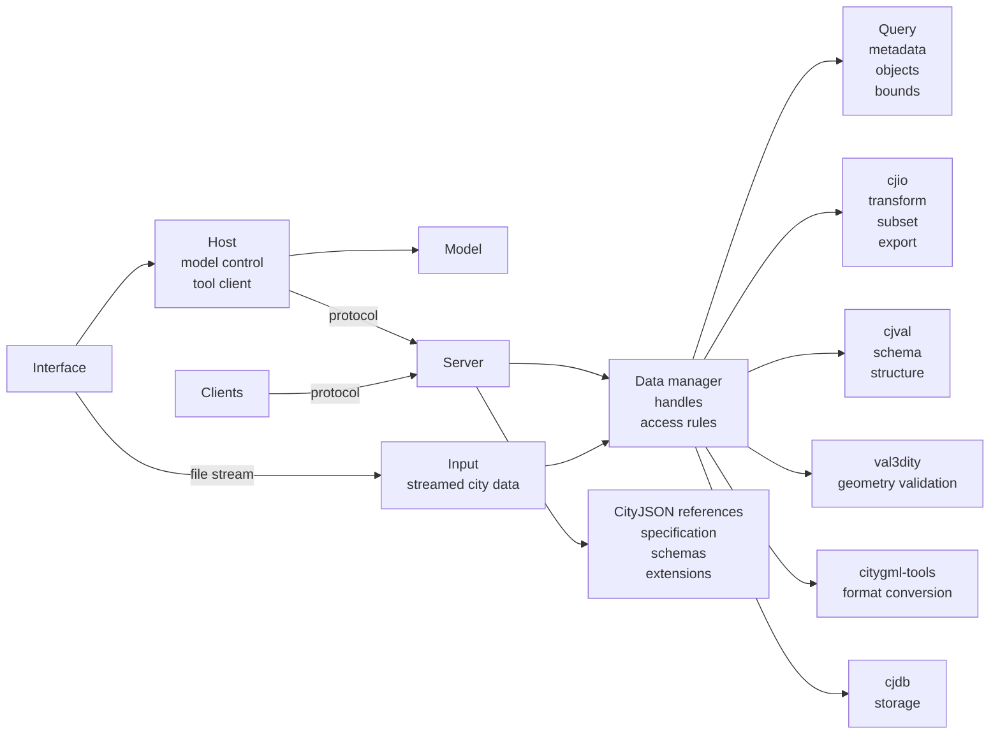

# CityJSON MCP

<p align="center">
  
</p>

<p align="center">
  <a href="LICENSE"></a>
  
  
  
  <a href="https://hub.docker.com/r/yarroudh/cityjson-mcp"></a>
  <a href="https://doi.org/10.5281/zenodo.22151334"></a>
  <a href="https://github.com/Yarroudh/cityjson-mcp/wiki"></a>
</p>

CityJSON MCP provides a web chat application and an MCP server for CityJSON files. It supports inspection, queries, validation, transformations, export, CityGML conversion, and cjdb/PostGIS operations.

The Docker image includes:

- `cjio` for CityJSON transformations and export.
- `cjval` for syntax, schema, and structural validation.
- `val3dity` for 3D geometry validation.
- `citygml-tools` for CityGML and CityJSON conversion.
- `cjdb` for PostgreSQL/PostGIS import and export.

<details>
<summary>Table of Contents</summary>

- [Demo](#demo)
- [Quick start: Datum chat application](#quick-start-datum-chat-application)
  - [Requirements](#requirements)
  - [1. Install the JavaScript dependencies](#1-install-the-javascript-dependencies)
  - [2. Create `.env`](#2-create-env)
    - [Cloud model providers](#cloud-model-providers)
      - [Recommended free cloud models through OpenRouter](#recommended-free-cloud-models-through-openrouter)
      - [OpenAI GPT Nano](#openai-gpt-nano)
      - [Other OpenAI-compatible providers](#other-openai-compatible-providers)
    - [Recommended cloud configurations](#recommended-cloud-configurations)
    - [Local models with Ollama](#local-models-with-ollama)
    - [Other model services](#other-model-services)
  - [3. Start Datum](#3-start-datum)
    - [Optional: build the image locally](#optional-build-the-image-locally)
- [Use the MCP server without Datum](#use-the-mcp-server-without-datum)
  - [Pull and verify the image](#pull-and-verify-the-image)
  - [Configure a file inbox](#configure-a-file-inbox)
  - [Claude Desktop](#claude-desktop)
  - [Claude Code](#claude-code)
  - [Cursor](#cursor)
  - [VS Code](#vs-code)
  - [Other MCP clients](#other-mcp-clients)
- [File and dataset handling](#file-and-dataset-handling)
- [Architecture](#architecture)
- [Tool catalog](#tool-catalog)
  - [Dataset management and inspection](#dataset-management-and-inspection)
  - [Validation](#validation)
  - [Transformations](#transformations)
  - [Export, conversion, and database](#export-conversion-and-database)
  - [Specification and schemas](#specification-and-schemas)
- [Example prompts](#example-prompts)
  - [Inspect a file](#inspect-a-file)
  - [Validate a file](#validate-a-file)
  - [Create a subset](#create-a-subset)
  - [Clean and download](#clean-and-download)
- [Configuration reference](#configuration-reference)
- [Run without Docker (not recommended)](#run-without-docker-not-recommended)
  - [Install Ollama manually](#install-ollama-manually)
- [Security](#security)
- [Contributing](#contributing)
- [Next](#next)
- [Tests](#tests)
- [Known limitations](#known-limitations)
- [Issues and Feedback](#issues-and-feedback)
- [Upstream Projects](#upstream-projects)
  - [CityJSON](#cityjson)
  - [CityJSON Tools](#cityjson-tools)
  - [Model Context Protocol](#model-context-protocol)
- [Citation](#citation)
  - [APA](#apa)
  - [IEEE](#ieee)
  - [BibTeX](#bibtex)
- [License](#license)
- [About Developer](#about-developer)

</details>

---

## Demo

The following video is a demo of Datum, the chat application in this repository. It shows importing a CityJSON file, inspecting it, creating a subset, and downloading the derived dataset.

[](https://www.youtube.com/watch?v=Pq2LojuAm-4)

---

## Quick start: Datum chat application

Datum is the official AI client provided with CityJSON MCP toolbox. It accepts CityJSON attachments in the browser, and lets a configured LLM model call the CityJSON tools to process datasets and answer user questions.

For a complete visual tour of the interface and its behavior, see the [Datum guide](docs/Datum.md).

For every supported setup path and environment option, see [Installation and configuration](docs/Installation.md).

### Requirements

- Docker Desktop or Docker Engine with Docker Compose.
- Node.js 20 or newer.
- An API key for a cloud model that supports tool calls, or a local Ollama model.

> Datum supports local Ollama models. However, for optimal performance and reliability, we recommend using a cloud model. Local models may encounter memory constraints, particularly with larger workloads, and have not yet been extensively tested.

### 1. Install the JavaScript dependencies

```bash
npm install
```

### 2. Create `.env`

Copy the example file:

```bash
cp .env.example .env
```

Set these values before starting Datum:

```dotenv
MODEL_PROVIDER=openrouter
MODEL_NAME=openrouter/free
MODEL_API_KEY=replace-with-your-openrouter-api-key
MODEL_BASE_URL=https://openrouter.ai/api/v1
MODEL_TEMPERATURE=0.1
```

The model settings mean:

| Variable | Required | Description |
|---|---:|---|
| `MODEL_PROVIDER` | yes | Model service: `ollama`, `openrouter`, `openai`, or `anthropic`. Ollama, OpenRouter, and OpenAI-compatible services use the OpenAI Chat Completions format internally. |
| `MODEL_NAME` | yes | Exact model identifier sent to the provider, for example `openrouter/free`. The model must support tool calls. |
| `MODEL_API_KEY` | except Ollama | API credential issued by the model provider. Local Ollama needs no key. Do not commit `.env`. |
| `MODEL_BASE_URL` | yes | Base URL for the provider API. |
| `MODEL_TEMPERATURE` | no | Sampling temperature. Datum defaults to `0.1`. |
| `OLLAMA_CONTEXT_LENGTH` | no | Ollama context window in tokens. Defaults to `16384`; larger values use more RAM or VRAM. |

The `.env` model is the default model in Datum. Users can add other models from the model menu in the UI. Models added through the interface remain in server memory for up to eight hours. Their API keys are not returned to the browser or passed to MCP tools.

#### Cloud model providers

Datum supports OpenRouter, OpenAI-compatible APIs, and Anthropic as cloud providers. Credentials stay in the running application and are not passed to MCP tools. Datum runs a live tool-call check before accepting any model because catalog metadata alone does not guarantee reliable agent behavior.

##### Recommended free cloud models through OpenRouter

Create an [OpenRouter API key](https://openrouter.ai/settings/keys), choose **OpenRouter (cloud catalog)** in Datum, and paste the key. Select **Free Models Router** at the top of the refreshed catalog. It uses the stable `openrouter/free` ID and automatically selects an available free model compatible with requested features such as tool calling.

To make it the default:

```dotenv
MODEL_PROVIDER=openrouter
MODEL_NAME=openrouter/free
MODEL_API_KEY=paste-your-openrouter-key-here
MODEL_BASE_URL=https://openrouter.ai/api/v1
MODEL_TEMPERATURE=0.1
```

This is Datum's recommended free-cloud configuration. It avoids depending on one free provider's capacity, but the selected model can vary between calls. Free usage is intended for experimentation and low-volume work, is rate-limited, and may be less predictable than paid inference. You can still select a specific `:free` model when model consistency matters more than automatic availability.

##### OpenAI GPT Nano

Use the OpenAI choice with an API key:

```dotenv
MODEL_PROVIDER=openai
MODEL_NAME=gpt-5-nano
MODEL_API_KEY=paste-your-openai-api-key-here
MODEL_BASE_URL=https://api.openai.com/v1
```

GPT-5 Nano supports function calling but the OpenAI API does not provide it on the free usage tier. It is inexpensive and useful for testing, although a stronger coding model may be more reliable for long CityJSON tool workflows.

##### Other OpenAI-compatible providers

For any service exposing an OpenAI-compatible Chat Completions endpoint, choose **OpenAI-compatible API**, then enter the provider's exact model ID, API key, and base URL. This covers services such as Gemini and DeepSeek without hard-coding a changing provider directory. Services requiring a different protocol, OAuth flow, or custom request headers are not automatically compatible.

`MODEL_API_KEY` takes precedence for the default model. Datum also recognizes `OPENROUTER_API_KEY`, `OPENAI_API_KEY`, and `ANTHROPIC_API_KEY` for their matching `MODEL_PROVIDER`. All of these model credentials are removed from the environment passed to the MCP subprocess.

#### Recommended cloud configurations

For free experimentation, use `openrouter/free` as shown above. OpenRouter chooses a currently available free model and filters for capabilities required by the request. Its free tier has limited request quotas and free-provider capacity can fluctuate.

For the best reliability and more demanding CityJSON tool workflows, use a paid Gemini or DeepSeek model through its OpenAI-compatible endpoint. Choose **OpenAI / compatible API** in Datum and enter the provider's model ID, API key, and base URL. Paid models avoid the tight shared-capacity limits of free endpoints and keep the model stable throughout a conversation.

Google API keys are managed in [Google AI Studio](https://aistudio.google.com/app/apikey); see Google's [OpenAI compatibility guide](https://ai.google.dev/gemini-api/docs/openai) and [pricing](https://ai.google.dev/gemini-api/docs/pricing). For DeepSeek, use its [API documentation and pricing](https://api-docs.deepseek.com/quick_start/pricing/). Review each provider's data policy before sending confidential CityJSON datasets.

#### Local models with Ollama

Ollama is an optional companion service. A normal `npm run chat` enables it automatically only when `.env` has `MODEL_PROVIDER=ollama`. Cloud-model configurations start Datum without inspecting, pulling, or starting the Ollama image. The launcher prints the selected mode before it checks Docker images.

Override the automatic choice when needed:

```bash
# Keep Ollama available alongside a cloud default
npm run chat -- --with-ollama

# Start only Datum, even if .env currently selects Ollama
npm run chat -- --without-ollama
```

For a persistent setting, use `CHAT_ENABLE_OLLAMA=true` or `CHAT_ENABLE_OLLAMA=false` in `.env`. Command-line flags take precedence. If Ollama is enabled, no separate installation is required: the launcher first looks for native Ollama on macOS and otherwise pulls the official image when missing. Docker model downloads remain in the `ollama-models` volume.

To make an Ollama model the default, configure `.env`:

```dotenv
MODEL_PROVIDER=ollama
MODEL_NAME=qwen3:8b
MODEL_API_KEY=
MODEL_BASE_URL=http://ollama:11434/v1
MODEL_TEMPERATURE=0.1
OLLAMA_CONTEXT_LENGTH=16384
```

> ❗ **Important:** Always make sure to use a model that supports **tool calls**. For more information, please refer to: https://ollama.com/search?c=tools

When Ollama is enabled, you can select it in Datum and pull a model with the add button. `npm run chat:stop` stops the active containers without deleting downloaded models. Deleting a model from Datum removes only its saved configuration; it does not remove the downloaded model from Ollama. If you want the downloaded model deleted, please use the following command:

```bash
ollama rm <model-name>
```

Local model quality and memory requirements vary. Datum evaluates a model's metadata and actual call output, then marks it **Recommended** or **Limited** in the model menu. Limited models remain usable, but may be less reliable for CityJSON workflows.

The default `16384` tokens context is a practical balance. Use `8192` if you have memory constraints or `32768` for longer conversations when sufficient memory is available. For bundled Docker Ollama, change `OLLAMA_CONTEXT_LENGTH` in `.env` and restart Datum. For native Ollama, set the same variable when launching Ollama and restart that service. Ollama applies this globally because its API endpoint does not accept the context size per request.

#### Other model services

Datum can use any model that supports `tool calls` through one of its two API formats. Examples:

| Service | `MODEL_PROVIDER` | Example model | `MODEL_BASE_URL` |
|---|---|---|---|
| Ollama | `ollama` | `qwen3:8b` | `http://ollama:11434/v1` |
| OpenRouter | `openrouter` | select a tool-capable model from the live catalog | `https://openrouter.ai/api/v1` |
| Google Gemini | `openai` | `gemini-3.7-flash` | `https://generativelanguage.googleapis.com/v1beta/openai` |
| DeepSeek | `openai` | `deepseek-v4-pro` | `https://api.deepseek.com` |
| OpenAI GPT | `openai` | a current GPT model with Chat Completions tool calling | `https://api.openai.com/v1` |
| Anthropic Claude | `anthropic` | a current Claude model with tool use | `https://api.anthropic.com` |

Model names and availability change. Confirm the exact model identifier in the provider documentation:

- [DeepSeek models and pricing](https://api-docs.deepseek.com/quick_start/pricing/)
- [OpenRouter model catalog](https://openrouter.ai/models?supported_parameters=tools)
- [Gemini models](https://ai.google.dev/gemini-api/docs/models)
- [OpenAI models](https://platform.openai.com/docs/models)
- [Claude models](https://docs.anthropic.com/en/docs/about-claude/models/overview)

### 3. Start Datum

```bash
npm run chat
```

Open <http://127.0.0.1:3000>.

The command starts the container in detached mode and returns to the terminal. Use these commands to view logs or stop the application:

```bash
npm run chat:logs
npm run chat:stop
```

`npm run chat` uses this image-selection sequence:

1. Read `.env` and resolve Ollama mode from `--with-ollama`, `--without-ollama`, `CHAT_ENABLE_OLLAMA`, or `MODEL_PROVIDER`, in that order.
2. Print whether startup is cloud-only, native Ollama, or bundled Ollama.
3. If Ollama is enabled on macOS, use a running native service when detected; otherwise pull the official Ollama image only when it is missing.
4. Check whether the CityJSON MCP image exists and pull it when missing.
5. Start Datum and, when selected, its Ollama companion in detached mode without building an image.

The application binds to `127.0.0.1:3000`. Docker volumes store imported files, derived datasets, and downloaded Ollama models. Ollama is available only to the internal Compose network and is not published on a host port.

### Optional: build the image locally

Build the image before `npm run chat` when you want to run local source changes:

```bash
npm run docker:cache:val3dity
npm run docker:cache:cjval
npm run docker:build
npm run docker:doctor
npm run chat
```

The `val3dity` and `cjval` build stages take the most time. They can be cached separately.

Set `CITYJSON_MCP_IMAGE` to use your created Docker image.

---

## Use the MCP server without Datum

The MCP server can run separately in Claude Desktop, Claude Code, Cursor, VS Code, or another client that supports local stdio MCP servers. A separate model API key is not required by the MCP server because the client supplies the model.

### Pull and verify the image

```bash
docker pull yarroudh/cityjson-mcp:latest
docker run --rm --entrypoint node yarroudh/cityjson-mcp:latest /app/scripts/doctor.mjs
```

The doctor command should report `OK` for `cjio`, `cjval`, `val3dity`, `citygml-tools`, and `cjdb`.

### Configure a file inbox

MCP tool calls do not contain ordinary chat attachments. Mount a host folder as `/input` for files that must be available to the MCP server. Replace `/absolute/path/to/cityjson-files` with an existing absolute path:

```json
{
  "mcpServers": {
    "cityjson": {
      "command": "docker",
      "args": [
        "run",
        "--rm",
        "-i",
        "--mount",
        "type=bind,source=/absolute/path/to/cityjson-files,target=/input,readonly",
        "--env",
        "CITYJSON_MCP_ALLOWED_ROOTS=/input:/data",
        "--env",
        "CITYJSON_MCP_INPUT=/input",
        "yarroudh/cityjson-mcp:latest"
      ]
    }
  }
}
```

Place `model.city.json` in the mounted folder, then ask the client:

> Import `model.city.json` and summarize it.

The model should call `cityjson_import` with the filename. It should not send the full file through `cityjson_import_text`.

Paths created by a chat client, such as `/mnt/user-data/...`, do not automatically exist in the MCP container.

### Claude Desktop

The template is [config/claude-desktop.json](config/claude-desktop.json). Add the inbox mount from the previous example when working with files.

Claude Desktop configuration locations:

- macOS: `~/Library/Application Support/Claude/claude_desktop_config.json`
- Windows: `%APPDATA%\Claude\claude_desktop_config.json`

Merge the `mcpServers.cityjson` entry into the existing file. Fully quit and reopen Claude Desktop. In a chat, enable the `cityjson` connector and allow its tools.

### Claude Code

Copy the template into the project where Claude Code runs:

```bash
cp config/claude-code.json .mcp.json
```

Add the inbox mount to `.mcp.json` when required, then restart or reconnect the MCP server.

### Cursor

The template is [config/cursor-mcp.json](config/cursor-mcp.json).

Use one of these locations:

- Project: `.cursor/mcp.json`
- Global: `~/.cursor/mcp.json`

Restart the MCP server after changing the file.

### VS Code

The template is [config/vscode-mcp.json](config/vscode-mcp.json). Copy its `servers.cityjson` entry into `.vscode/mcp.json`, then start or restart the server from the MCP server-management commands in VS Code.

### Other MCP clients

Use this command for any client that supports a local stdio MCP server:

```text
docker run --rm -i yarroudh/cityjson-mcp:latest
```

Add the `/input` mount shown above when the server must read local files.

---

## Architecture



---

## Tool catalog

The server exposes 37 tools.

For complete parameter schemas, backend behavior, return values, and example workflows, see the [CityJSON MCP tools reference](docs/CityJSON-MCP-Tools.md).

### Dataset management and inspection

| Tool | Backend | Purpose |
|---|---|---|
| `cityjson_backend_status` | native | Report backend availability and path settings. |
| `cityjson_list_imports` | native | List JSON files in the input directory. |
| `cityjson_import` | native | Import an input file and return a `dataset_id`. |
| `cityjson_import_text` | native | Import a small CityJSON document supplied as text. |
| `cityjson_open` | native | Open a CityJSON file from an authorized path. |
| `cityjson_download` | native | Return a source or derived CityJSON file. |
| `cityjson_save` | native | Copy a dataset to an authorized destination. |
| `cityjson_info` | native | Return version, counts, LoDs, attributes, metadata, transform, and extensions. |
| `cityjson_list_objects` | native | List CityObjects with pagination and type filters. |
| `cityjson_get_object` | native | Return one CityObject and its computed bounding box. |
| `cityjson_query` | native | Query by IDs, types, bounding box, and attribute predicates. |

### Validation

| Tool | Backend | Purpose |
|---|---|---|
| `cityjson_validate_schema` | cjval | Validate JSON syntax, schemas, extensions, and structural consistency. |
| `cityjson_validate_geometry` | val3dity | Validate supported 3D geometry primitives. |
| `cityjson_validate` | cjval + val3dity | Run both validators and return one result. |

### Transformations

Each tool in this table returns a new dataset handle.

| Tool | Backend | Purpose |
|---|---|---|
| `cityjson_subset` | cjio | Select or exclude objects by IDs, type, bounding box, radius, or random count. |
| `cityjson_filter_lod` | cjio | Keep one level of detail. |
| `cityjson_reproject` | cjio | Transform coordinates to a target EPSG CRS. |
| `cityjson_assign_crs` | cjio | Assign an EPSG CRS without changing coordinates. |
| `cityjson_translate` | cjio | Translate coordinates. |
| `cityjson_clean_vertices` | cjio | Remove duplicate and unused vertices. |
| `cityjson_triangulate` | cjio | Triangulate surfaces. |
| `cityjson_merge` | cjio | Merge two or more datasets. |
| `cityjson_attribute_rename` | cjio | Rename an attribute. |
| `cityjson_attribute_remove` | cjio | Remove an attribute. |
| `cityjson_remove_textures` | cjio | Remove textures. |
| `cityjson_remove_materials` | cjio | Remove materials. |
| `cityjson_upgrade` | cjio | Upgrade an older supported CityJSON version. |

### Export, conversion, and database

| Tool | Backend | Purpose |
|---|---|---|
| `cityjson_export` | cjio | Export to JSONL, OBJ, STL, GLB, or B3DM. |
| `citygml_to_cityjson` | citygml-tools | Convert CityGML to CityJSON or CityJSONSeq. |
| `cityjson_to_citygml` | citygml-tools | Convert CityJSON to CityGML. |
| `cityjson_db_import` | cjio + cjdb | Import a dataset into PostgreSQL/PostGIS. |
| `cityjson_db_export` | cjdb + cjio | Export all or selected objects from cjdb. |

### Specification and schemas

| Tool | Source | Purpose |
|---|---|---|
| `cityjson_spec_outline` | bundled index | Return the CityJSON specification outline and schema names. |
| `cityjson_spec_read` | cityjson.org | Read part of the CityJSON specification. |
| `cityjson_schema_read` | cityjson.org | Read a CityJSON JSON Schema. |
| `cityjson_extensions_registry` | CityJSON registry | List or search registered extensions. |
| `cityjson_extension_schema` | CityJSON registry | Read a registered extension schema. |

---

## Example prompts

### Inspect a file

> Import `model.city.json`. Report the version, CRS, object counts by type, LoDs, attributes, and extensions. Do not modify the dataset.

Expected tools: `cityjson_import`, `cityjson_info`.

### Validate a file

> Import `model.city.json`. Run structural and geometric validation. Separate cjval findings from val3dity findings and list affected object IDs.

Expected tools: `cityjson_import`, `cityjson_validate`.

### Create a subset

> Import `model.city.json`. Keep Building and BuildingPart objects inside bbox `[85000, 446000, 86000, 447000]`, keep LoD 2.2, reproject to EPSG:28992, validate the result, and give me the resulting file.

Expected tools: `cityjson_import`, `cityjson_subset`, `cityjson_filter_lod`, `cityjson_reproject`, `cityjson_validate`, `cityjson_download`.

### Clean and download

> Import `model.city.json`. Remove duplicate and unused vertices, validate the derived dataset, and return it as `tile-clean.city.json`. Do not overwrite the source.

Expected tools: `cityjson_import`, `cityjson_clean_vertices`, `cityjson_validate`, `cityjson_download`.

> In Datum, you can ignore the first instruction, **Import `<filename>`**, since file attachments are handled automatically. There is no need to manually place your models in the `input/` folder. You can import a CityJSON file directly using the **Import CityJSON** button or by dragging and dropping the file.

---

## Configuration reference

| Variable | Default | Purpose |
|---|---|---|
| `MODEL_PROVIDER` | `anthropic` | Model service: `ollama`, `openrouter`, `openai`, or `anthropic`. |
| `MODEL_NAME` | none | Default Datum model identifier. |
| `MODEL_API_KEY` | none | Default Datum model API key. |
| `MODEL_BASE_URL` | provider default | Model API base URL. |
| `MODEL_MAX_OUTPUT_TOKENS` | `4096` | Maximum output tokens per model call. |
| `MODEL_TEMPERATURE` | `0.1` | Model sampling temperature. |
| `CHAT_ENABLE_OLLAMA` | automatic | Start bundled/native Ollama with Datum. When unset, enabled only for `MODEL_PROVIDER=ollama`; CLI flags override it. |
| `CHAT_HOST` | `127.0.0.1` | Datum bind address outside Docker. |
| `CHAT_PORT` | `3000` | Datum port. |
| `CHAT_MAX_UPLOAD_BYTES` | `1073741824` | Maximum upload size. |
| `CHAT_MAX_UPLOAD_FILES` | `5` | Maximum files per upload. |
| `CHAT_MAX_TOOL_ROUNDS` | `12` | Maximum tool-call rounds per response. |
| `CITYJSON_MCP_ALLOWED_ROOTS` | current directory | Authorized filesystem roots. Use `:` on macOS/Linux and `;` on Windows. |
| `CITYJSON_MCP_INPUT` | `./input` | Input directory used by `cityjson_import`. |
| `CITYJSON_MCP_WORKSPACE` | `./.cityjson-mcp-workspace` | Managed source and derived datasets. |
| `CITYJSON_MCP_COMMAND_TIMEOUT_MS` | `120000` | External command timeout. |
| `CITYJSON_MCP_MAX_DOWNLOAD_BYTES` | `26214400` | Maximum inline MCP download size. Datum streams downloads directly. |
| `CJIO_BIN` | `cjio` | Optional cjio executable override. |
| `CJVAL_BIN` | `cjval` | Optional cjval executable override. |
| `VAL3DITY_BIN` | `val3dity` | Optional val3dity executable override. |
| `CITYGML_TOOLS_BIN` | `citygml-tools` | Optional citygml-tools executable override. |
| `CJDB_BIN` | `cjdb` | Optional cjdb executable override. |

Set `PGPASSWORD` in the process environment for cjdb. Database tool arguments do not accept a password.

---

## Run without Docker (not recommended)

Running without Docker requires Node.js and the backend executables used by the requested tools.

```bash
npm install
npm run doctor
npm test
npm run check
npm start
```

### Install Ollama manually

Manual Ollama installation is needed only when running Datum directly with `npm run chat:host` or when using Ollama outside this project's Docker stack.

- **macOS:** download the `.dmg` from the [official Ollama download page](https://ollama.com/download), move Ollama to Applications, and launch it. macOS 14 or newer is required.
- **Windows:** download and run `OllamaSetup.exe` from the [official Ollama download page](https://ollama.com/download/windows). Ollama starts in the background and exposes its API on port `11434`.
- **Linux:** install and start Ollama with:

  ```bash
  curl -fsSL https://ollama.com/install.sh | sh
  ollama serve
  ```

In another terminal, pull a model that supports **tool calls** and verify the installation:

```bash
ollama pull qwen3:8b
curl http://127.0.0.1:11434/api/tags
```

For host mode, use this model configuration:

```dotenv
MODEL_PROVIDER=ollama
MODEL_NAME=qwen3:8b
MODEL_API_KEY=
MODEL_BASE_URL=http://127.0.0.1:11434/v1
OLLAMA_BASE_URL=http://127.0.0.1:11434/v1
OLLAMA_CONTEXT_LENGTH=16384
```

Then start Datum with `npm run chat:host`. Native Ollama is recommended on macOS when model performance matters because it can use Apple Metal acceleration; the Docker Desktop container cannot use the Mac GPU.

Backend installation sources:

- [cjio](https://github.com/cityjson/cjio)
- [cjval](https://github.com/cityjson/cjval)
- [val3dity](https://github.com/tudelft3d/val3dity)
- [citygml-tools](https://github.com/citygml4j/citygml-tools)
- [cjdb](https://github.com/cityjson/cjdb)

Use `npm run chat:host` only when all required backends are installed locally. Datum checks backend availability during startup. `CHAT_ALLOW_PARTIAL_BACKENDS=true` allows startup with missing backends for development tests.

---

## Security

- File operations are limited to `CITYJSON_MCP_ALLOWED_ROOTS`, the input directory, and the managed workspace.
- Browser uploads receive generated storage names.
- MCP tools do not expose arbitrary shell commands.
- External commands use argument arrays with `shell: false`.
- Tool inputs are validated with Zod schemas.
- Database passwords remain in the process environment.
- cjdb export accepts only a single `SELECT` statement, but this check is not a database security boundary. Use a database role with limited permissions.
- Commands have time and output limits.
- Treat installation of any local MCP server as installation of local code.

---

## Contributing

1. Fork the repository and create a branch for one change.
2. Install dependencies with `npm install`.
3. Make the change. Keep MCP tool inputs typed and do not add shell-string execution.
4. Add or update tests for changed behavior.
5. Run:

   ```bash
   npm test
   npm run check
   ```

6. If the change affects a Docker backend, build the image and run `npm run docker:doctor`.
7. Update the README and `.env.example` when configuration or user-visible behavior changes.
8. Open a pull request that states what changed, why it changed, and how it was tested.

Do not include API keys, database passwords, private CityJSON datasets, generated workspaces, or `.env` files in a contribution.

---

## Next

- [x] Add explicit Ollama setup and model presets for local models.
- [x] Stream model responses and tool progress to the browser.
- [x] Add cancellation and progress reporting for long validation and conversion jobs.
- [x] Add an optional 3D preview for imported and derived datasets.

---

## Tests

Run the test suite:

```bash
npm test
```

Run syntax checks for project `.mjs` files:

```bash
npm run check
```

Verify every executable in the Docker image:

```bash
npm run docker:doctor
```

---

## Known limitations

- Dataset handles are scoped to the current process. If the MCP server restarts, any existing `dataset_id` values become invalid and must be recreated.
- Native inspection loads regular CityJSON files into memory.
- `cityjson_query` computes bounding boxes from geometry stored directly on each object. It does not combine all child geometry into a parent bounding box.
- Specification, schema, and extension lookup tools require network access, except for `cityjson_spec_outline`.
- Derived workspace files are not deleted automatically.
- Exact export and conversion behavior depends on the installed backend versions.
- `val3dity` is GPL-3.0 software and runs as a separate executable. Review upstream licenses before redistributing a modified image.

---

## Issues and Feedback

If you encounter a bug, unexpected behavior, or have a suggestion for improvement, please open an issue in the repository.

When reporting an issue, include as much relevant information as possible, such as:

- A clear description of the problem
- Steps to reproduce the issue
- Expected and actual behavior
- Relevant logs or error messages
- Your environment and configuration, when applicable

Feature requests and other constructive feedback are also welcome. Before opening a new issue, please check the existing issues to avoid duplicates.

---

## Upstream Projects

This project builds on and integrates with several projects and specifications from the CityJSON, 3D city modelling, and Model Context Protocol ecosystems.

### CityJSON

- [CityJSON specification](https://www.cityjson.org/specs/) — Official CityJSON specification and documentation.
- [CityJSON specification repository](https://github.com/cityjson/specs) — Source repository for the CityJSON specification.
- [CityJSON Extensions registry](https://github.com/cityjson/extensions) — Registry of CityJSON extensions maintained by the community.

### CityJSON Tools

- [cjio](https://github.com/cityjson/cjio) — Command line tools and Python utilities for working with CityJSON.
- [cjval](https://github.com/cityjson/cjval) — Validation tools for CityJSON datasets.
- [cjdb](https://github.com/cityjson/cjdb) — Database tools for storing and querying CityJSON data.
- [val3dity](https://github.com/tudelft3d/val3dity) — Validation of 3D geometries and 3D city models.
- [citygml-tools](https://github.com/citygml4j/citygml-tools) — Command line tools for processing and converting CityGML datasets.

### Model Context Protocol

- [Model Context Protocol TypeScript SDK](https://github.com/modelcontextprotocol/typescript-sdk) — TypeScript SDK for implementing Model Context Protocol servers and clients.

> These projects are developed and maintained independently by their respective authors and communities. Please refer to their repositories for documentation, licensing, and support.

---

## Citation

We are committed to supporting open and reproducible research and welcome the use of this project in academic and scientific work. If you use this project in your research, please cite it as follows:

### APA

> Yarroudh. (2026). Yarroudh/cityjson-mcp: CityJSON MCP & Datum Chat Application (Version 0.2.0) [Computer software]. Zenodo. https://doi.org/10.5281/zenodo.22151334

### IEEE

> [1] Yarroudh, Yarroudh/cityjson-mcp: CityJSON MCP & Datum Chat Application (Version 0.2.0). (Aug. 28, 2026). Zenodo. doi: 10.5281/zenodo.22151334.

### BibTeX

```bibtex
@software{yarroudh2026cityjsonmcp,
  author    = {Yarroudh},
  title     = {Yarroudh/cityjson-mcp: CityJSON MCP \& Datum Chat Application},
  year      = {2026},
  version   = {0.2.0},
  publisher = {Zenodo},
  doi       = {10.5281/zenodo.22151334},
  url       = {https://doi.org/10.5281/zenodo.22151334}
}
```

---

## License

This repository uses the MIT License. See [LICENSE](LICENSE).

The bundled image invokes external programs under their own licenses. This repository does not relicense those programs.

---

## About Developer

This project is developed and maintained by **Anass Yarroudh**, a Data Scientist and Machine Learning Engineer at **GIM**, and a Research Associate at the **University of Liège**.

This repository is a personal side project developed independently and is not affiliated with, endorsed by, or maintained on behalf of any of my professional or academic affiliations.

For professional inquiries or to connect, feel free to reach out on [LinkedIn](https://www.linkedin.com/in/anass-yarroudh/).
