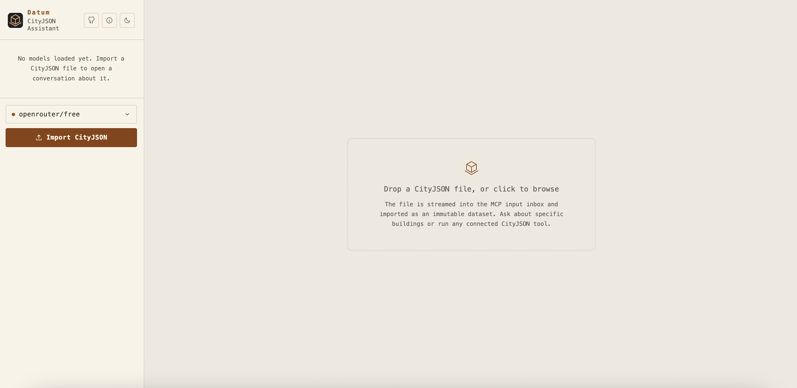
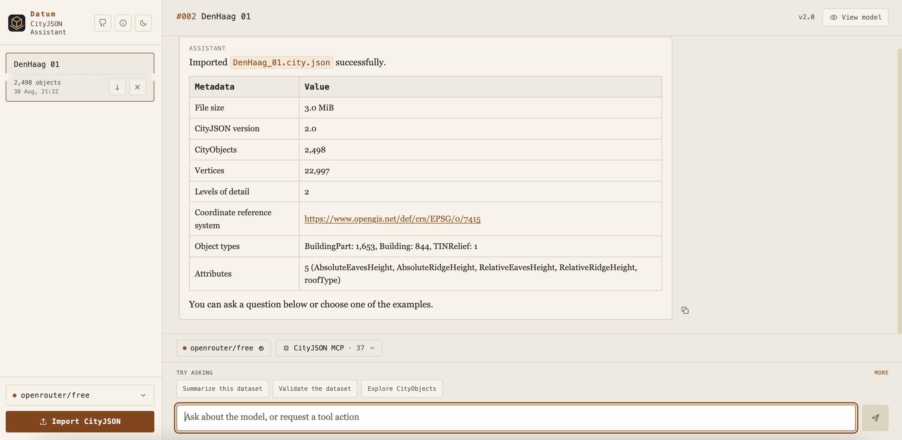
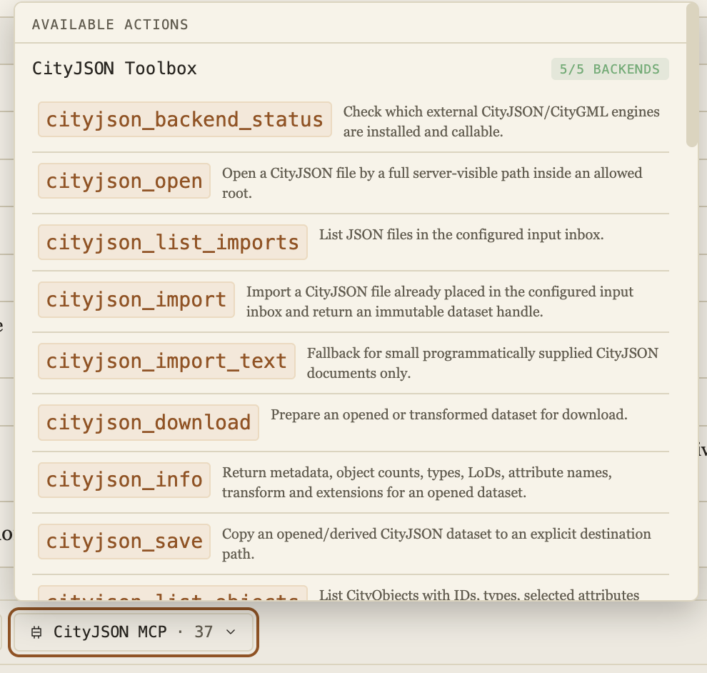
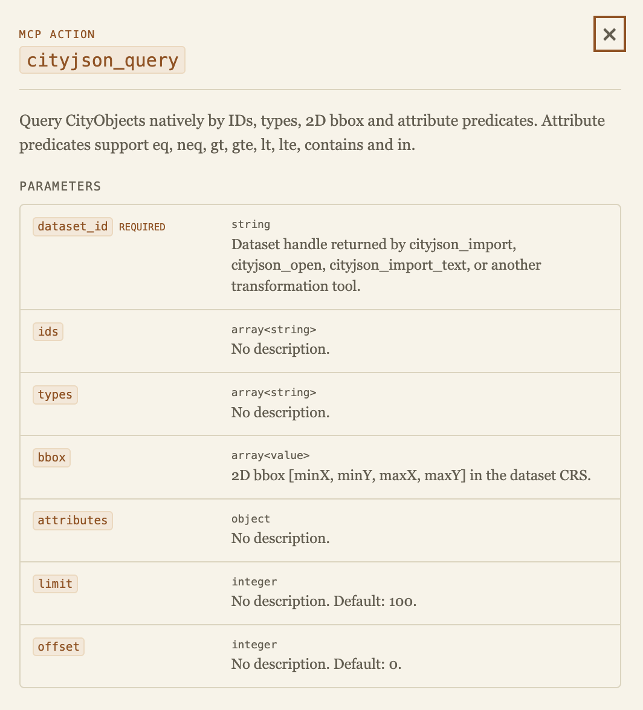
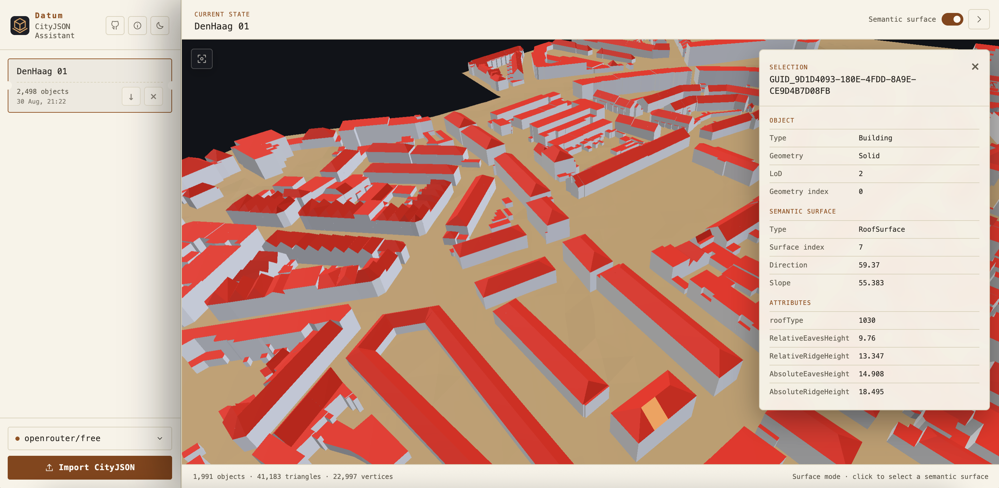
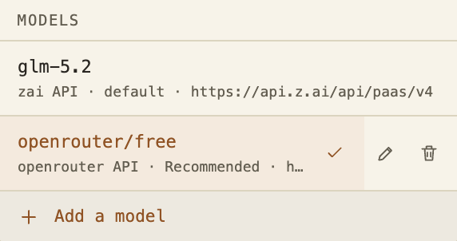
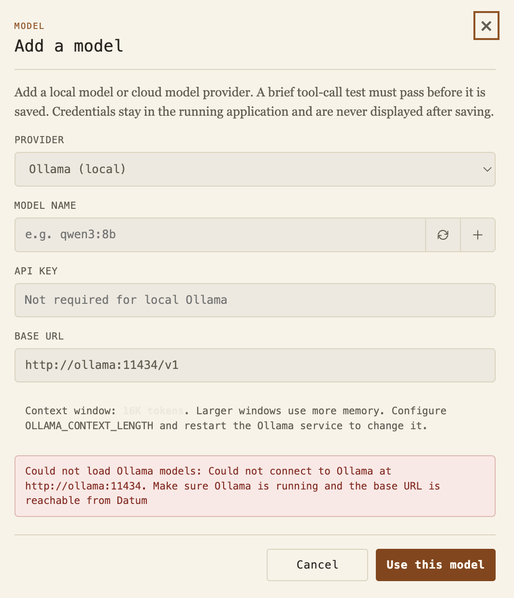

# Datum

Datum is the browser application included with CityJSON MCP. It lets a user import a CityJSON file, discuss its contents with a language model, run the 37 MCP tools, inspect the current result in three dimensions, and download source or derived datasets.

The language model must support tool calls. Datum supports Ollama, OpenRouter, OpenAI compatible services, and Anthropic.

## Interface overview

Datum has three main areas:

1. The sidebar contains conversations, model selection, downloads, deletion controls, and CityJSON import.
2. The conversation area contains dataset summaries, messages, tool activity, suggestions, and the prompt composer.
3. The viewer appears beside the conversation when requested and displays the current dataset state.

The interface supports light and dark themes. Conversation state is restored in the same browser for up to eight hours.

## Import a CityJSON file

Drag one or more JSON files onto the import area, click the import area, or use the Import CityJSON button. Datum processes each selected file as a separate conversation.

The import sequence is:

1. The browser streams the file to the Datum upload endpoint.
2. Datum stores it in the configured MCP input inbox with a generated storage name.
3. Datum calls `cityjson_import` through the MCP gateway.
4. The MCP server parses the file and registers an immutable dataset handle.
5. Datum creates a conversation and displays a local summary before the first model request.

Only JSON files are accepted by the browser interface. The upload count and size are controlled by `CHAT_MAX_UPLOAD_FILES` and `CHAT_MAX_UPLOAD_BYTES`.

## Conversation workspace

Each imported file creates a conversation card. The card shows the file name, CityObject count, import time, download control, and deletion control.

The initial assistant card is generated from the import result. It includes file size, CityJSON version, CityObject and vertex counts, levels of detail, coordinate reference system, object types, and attribute names. This first summary does not require a model call.

The prompt area contains:

* The active model selector.
* The CityJSON MCP tool selector and current tool count.
* Suggested questions based on the current conversation state.
* The message field and send control.

Suggested questions are shortcuts. Selecting one places the prompt in the composer, where it can be reviewed or changed before sending.

### What happens during a message

1. Datum sends the user message, browser client identifier, conversation identifier, and current dataset handle to the server.
2. The server restores the matching conversation history and attaches the active dataset context.
3. The selected language model receives the 37 MCP tool schemas.
4. The model can call one or more tools over several rounds.
5. Datum streams status updates, text, tool starts, progress, and tool completion events to the browser.
6. If a transformation returns a new dataset handle, that handle becomes the current conversation state.
7. The final answer and available downloads are stored with the browser conversation.

Only one response can run at a time for a conversation. A running response can be cancelled. Messages can be copied, and earlier user questions can be retried from their saved server checkpoint while that checkpoint exists.

## Tool catalog

Open the CityJSON MCP selector to see all available actions. The header reports backend readiness. A complete installation reports five available external backends.

Each row shows the exact MCP tool name and a short description. Selecting a row opens its parameter documentation. Opening the catalog does not execute a tool. Tools are executed when the language model requests them during a conversation.

For complete behavior and workflow information, see the [CityJSON MCP tools reference](CityJSON-MCP-Tools).

## Tool details

The tool details dialog is generated from the MCP input schema. It shows:

* The exact tool name.
* The server description.
* Every top level parameter.
* Whether a parameter is required.
* The schema type, description, and default value when available.

This dialog is a quick reference for the schema exposed to the model. The dedicated tools page adds implementation details, backend behavior, return values, and workflow guidance.

## Three dimensional viewer

Choose View model to open the current dataset beside the conversation. Datum requests the latest dataset handle, obtains a downloadable CityJSON representation from the MCP server, parses it in the browser, and renders it with Three.js.

The viewer supports:

* Orbit with pointer drag.
* Zoom with the scroll wheel.
* Pan with the secondary pointer button.
* Fit the complete dataset in view.
* Select a CityObject.
* Switch to semantic surface selection.
* Inspect object type, geometry type, level of detail, attributes, relationships, and semantic surface values.
* View rendered object, triangle, and vertex counts.

Object mode colors geometry by CityObject type. Semantic surface mode uses the semantic surface information stored in each geometry. The viewer reads the current derived dataset, not always the originally imported file.

Large datasets require more browser memory and graphics processing time. If a source dataset handle expired after a server restart, Datum attempts to restore it from the stored inbox file. A derived dataset must be recreated when its workspace state is no longer available.

## Model management

The model menu lists the default model and additional models added through the interface. The active entry has a check mark. User entries can be selected, edited, or deleted. Deleting an entry removes its Datum configuration. It does not delete a model stored by Ollama.

Changing the active model clears the matching server conversation sessions. This prevents conversation history created for one provider and model from being reused with a different one. Browser messages remain visible.

### Add or edit a model

The model dialog supports four provider choices:

| Provider | API format | Notes |
|---|---|---|
| Ollama | OpenAI Chat Completions compatible | Local service. API key is not required. Installed models can be discovered, and a bundled model can be pulled when Ollama is enabled. |
| OpenRouter | OpenAI Chat Completions compatible | Loads a live catalog filtered for tool support. `openrouter/free` is the recommended free cloud starting point. |
| OpenAI compatible | OpenAI Chat Completions | Accepts OpenAI and other compatible service URLs, model identifiers, and keys. |
| Anthropic | Anthropic Messages | Uses native Anthropic tool use requests and responses. |

Adding or editing a model requires a provider, model identifier, base URL, and an API key when the provider requires one. Datum performs a live tool call test before saving the configuration. This test catches invalid credentials, incompatible endpoints, and models that return text instead of the required tool call.

Ollama and OpenRouter support model discovery. Ollama discovery reads the local model library. OpenRouter discovery loads the current tool capable catalog and places `openrouter/free` first.

The error shown in the screenshot demonstrates connection feedback. Datum does not save an Ollama profile when it cannot reach the configured service.

### Model configuration lifetime

The model configured in `.env` is the default. Additional model profiles are stored only in Datum server memory. They expire after eight hours of inactivity and disappear when the server restarts.

API keys are never returned in the public model configuration sent to the browser. Editing a profile can preserve the existing key by leaving the field empty. Model credentials are removed from the environment passed to the MCP child process, so CityJSON tools do not receive them.

## Downloads and derived datasets

The download control on a conversation card downloads the current dataset handle. If the conversation created a subset, reprojection, cleaned file, or another transformation, the downloaded file is that derived state.

When a user explicitly requests a download in chat, Datum also asks the MCP server to prepare a download resource. Download links remain in temporary server memory for thirty minutes.

Datum never substitutes the original file when a requested transformation did not complete. This prevents a failed subset or conversion request from silently returning the wrong dataset.

## State and persistence

Datum stores up to 25 conversations in browser local storage. The browser cache includes messages, dataset identifiers, conversation metadata, and the active conversation. It expires after eight hours.

The server keeps model conversation history, retry checkpoints, active turns, temporary uploads, user model profiles, and download links in memory. Restarting the server clears this state. Imported and derived datasets remain available according to the configured MCP workspace and its registry.

## Security and privacy

Datum applies several boundaries around browser, model, and tool activity:

* Browser output is sanitized before rendered Markdown is inserted into the page.
* The server applies a restrictive content security policy and blocks framing.
* Uploads receive generated storage names.
* Model keys remain in the server process and are not sent to MCP tools.
* Tool inputs are validated by the MCP server.
* File operations are restricted to allowed roots, the input inbox, and the managed workspace.
* External commands run without a shell and have time and output limits.
* Database passwords remain in the server environment.
* Downloads are served through temporary identifiers rather than arbitrary paths.

The selected language model still receives user prompts and compact tool results. Review the provider data policy before processing confidential data.

## Configuration

The most relevant Datum settings are:

| Variable | Purpose |
|---|---|
| `MODEL_PROVIDER` | Default provider: `ollama`, `openrouter`, `openai`, or `anthropic`. |
| `MODEL_NAME` | Default model identifier. |
| `MODEL_API_KEY` | Default provider credential. |
| `MODEL_BASE_URL` | Default provider API URL. |
| `MODEL_MAX_OUTPUT_TOKENS` | Maximum output tokens for one model response. |
| `MODEL_TEMPERATURE` | Sampling temperature. |
| `OLLAMA_CONTEXT_LENGTH` | Context size for Ollama. |
| `CHAT_HOST` and `CHAT_PORT` | Datum network binding. |
| `CHAT_MAX_UPLOAD_BYTES` | Maximum upload size. |
| `CHAT_MAX_UPLOAD_FILES` | Maximum files in one selection. |
| `CHAT_MAX_TOOL_ROUNDS` | Maximum model and tool rounds for one answer. |
| `CHAT_ALLOW_PARTIAL_BACKENDS` | Allows interface inspection when some external backends are unavailable. |

The full environment reference and provider examples are in the [project README](https://github.com/Yarroudh/cityjson-mcp#quick-start-datum-chat-application).

## Troubleshooting

### Datum does not start

Run `npm run chat` for the Docker workflow. Datum checks the CityJSON backend bundle during startup. Missing backends stop startup unless partial backend mode is explicitly enabled for development inspection.

### A model is rejected

Confirm the provider, exact model identifier, API key, and base URL. The model must complete Datum's live tool call test. A valid key can still receive provider quota, billing, capacity, or rate limit errors.

### Ollama cannot be reached

Confirm that Ollama is running and that the base URL is reachable from the environment where Datum runs. A Docker container normally uses the internal Ollama service URL. Direct host mode normally uses `127.0.0.1`.

### Free OpenRouter calls return an error

Free provider capacity and request quotas can change. Retry later or keep `openrouter/free` selected so OpenRouter can choose another compatible free model. Paid Gemini or DeepSeek services are generally more predictable for demanding workflows.

### A backend is missing

Open the tool catalog and inspect the backend count, or call `cityjson_backend_status`. Docker is the recommended way to obtain the complete backend bundle.

### The viewer cannot load a dataset

Confirm that the conversation still has a valid dataset handle. Imported sources can often be restored from the inbox after a restart. Derived datasets may need to be recreated.

### A download expired

Request the download again. Temporary download identifiers expire after thirty minutes.

## Next steps

* Review all [37 MCP tools](CityJSON-MCP-Tools).
* Read installation and provider examples in the [README](https://github.com/Yarroudh/cityjson-mcp#readme).
* Report problems through the [issue tracker](https://github.com/Yarroudh/cityjson-mcp/issues).
