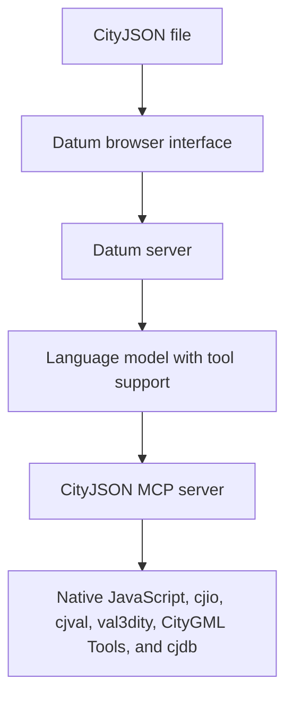

# CityJSON MCP

Welcome to the documentation for CityJSON MCP and Datum.

CityJSON MCP gives an AI client controlled access to CityJSON inspection, validation, transformation, conversion, database, and specification tools. Datum is the browser application included with the project. It combines those tools with a language model that supports tool calls.


## Start here

| Page | Use it for |
|---|---|
| [Installation and configuration](Installation) | Install Docker or host backends, configure models and paths, connect MCP clients, verify, update, and troubleshoot. |
| [Datum guide](Datum) | Learn the interface, import workflow, viewer, model management, security, and troubleshooting. |
| [CityJSON MCP tools reference](CityJSON-MCP-Tools) | Review every tool, parameter, backend, return value, and common workflow. |
| [Project README](https://github.com/Yarroudh/cityjson-mcp#readme) | Install the project, configure the environment, and start the services. |
| [Issue tracker](https://github.com/Yarroudh/cityjson-mcp/issues) | Report a bug or request an improvement. |

## What the project provides

CityJSON MCP exposes 37 tools through the Model Context Protocol. Together they can:

* Import CityJSON from an inbox, text, an allowed path, or a remote URL.
* Inspect metadata, object types, attributes, levels of detail, and individual CityObjects.
* Query by identifiers, object types, bounding boxes, radius, and attributes.
* Validate schemas with cjval and geometry with val3dity.
* Create subsets, filter levels of detail, reproject, translate, clean, triangulate, and merge.
* Rename or remove attributes, textures, and materials.
* Export CityJSON to several geometry formats.
* Convert between CityJSON and CityGML.
* Import into and export from cjdb.
* Read CityJSON specifications, schemas, and extension information.

Datum adds a visual workflow around these tools. It provides file import, conversations, suggested questions, live tool progress, downloads, model management, and a Three.js viewer.

## How the pieces connect



The language model decides which MCP tool to call. The MCP server validates the parameters, runs the relevant implementation, and returns structured results. Datum shows progress and keeps the current dataset handle attached to the conversation.

## Dataset handles

An imported file receives a dataset handle. Inspection tools read that handle. Transformation tools create a new handle and leave the source dataset unchanged. Datum follows the newest handle in the conversation, so the viewer and download action use the current result.

This design allows a sequence such as subset, reproject, validate, and download without overwriting the imported file.

## Backend responsibilities

| Component | Responsibility |
|---|---|
| Native JavaScript | Dataset registration, metadata, object inspection, query, files, and downloads. |
| cjio | Transformations, export, upgrade, and CityJSON sequence conversion. |
| cjval | CityJSON schema and structural validation. |
| val3dity | Three dimensional geometry validation. |
| CityGML Tools | Conversion between CityGML and CityJSON. |
| cjdb | PostgreSQL and PostGIS import and export. |
| Knowledge adapter | Specification, schema, and extension retrieval. |

Run `cityjson_backend_status` when an external backend operation is unavailable.

## Quick start

Install the JavaScript dependencies and create the environment file:

```bash
npm install
cp .env.example .env
```

Configure a model that supports tool calls, then start Datum:

```bash
npm run chat
```

Open `http://127.0.0.1:3000` and import a CityJSON file. The [Datum guide](Datum) explains the complete interface and workflow.

## Safety model

* File access is limited to configured roots, the input inbox, and the managed workspace.
* Tool parameters are validated before execution.
* External commands run without a shell and have time and output limits.
* Model credentials remain in the Datum server process and are removed from the environment passed to the MCP process.
* Database passwords remain in the server environment.
* Transformations create derived datasets instead of changing source files.

Treat any local MCP server as trusted local software and review model provider policies before sending confidential datasets.

## Recommended reading

New users should begin with [Installation and configuration](Installation), continue with the [Datum guide](Datum), then keep the [tools reference](CityJSON-MCP-Tools) open while trying the example workflows.
